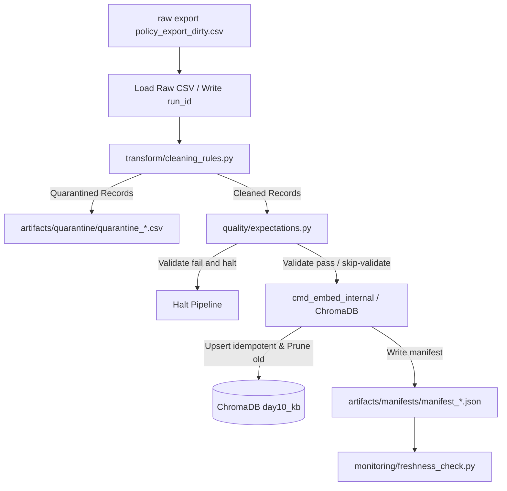

# Kiến trúc pipeline — Lab Day 10

**Nhóm:** AI Data Operations Group  
**Cập nhật:** 2026-06-10

---

## 1. Sơ đồ luồng (Mermaid)

---

## 2. Ranh giới trách nhiệm

| Thành phần | Input | Output | Owner nhóm |
|------------|-------|--------|--------------|
| Ingest | Raw CSV file | Python dict list | Ingestion Owner |
| Transform | Raw dict list, Rules | Cleaned and Quarantine list | Cleaning / Quality Owner |
| Quality | Cleaned list, expectations | ExpectationResults, Halt flag | Cleaning / Quality Owner |
| Embed | Cleaned CSV | Chroma collection update | Embed Owner |
| Monitor | Manifest JSON | Freshness status | Monitoring / Docs Owner |

---

## 3. Idempotency & rerun

- **Cơ chế Idempotency:** Sử dụng mã hash SHA-256 từ `doc_id`, `chunk_text`, và số thứ tự `seq` để sinh ra `chunk_id` ổn định.
- **Không duplicate vector:** ChromaDB thực hiện thao tác `upsert` trên `chunk_id` này. Khi chạy lại pipeline với cùng một phiên bản dữ liệu sạch, các bản ghi cũ sẽ được ghi đè chứ không tạo mới.
- **Snapshot publish & Prune:** Để tránh rác dữ liệu từ lần chạy trước làm sai kết quả tìm kiếm, pipeline tự động so sánh và xoá (`delete`) các `chunk_id` cũ trong cơ sở dữ liệu không còn xuất hiện trong lần chạy sạch hiện tại.

---

## 4. Liên hệ Day 09

- Pipeline này đóng vai trò là tầng tiền xử lý và cung cấp tri thức sạch đã được chuẩn hoá (chính sách nghỉ phép 2026, SLA xử lý ticket P1, chính sách hoàn tiền 7 ngày) cho các Agent hoạt động ở Day 09.
- Bằng cách đảm bảo dữ liệu trong Chroma DB luôn tươi mới và không bị trùng lặp/sai lệch, Agent sẽ truy xuất đúng context nghiệp vụ mà không bị ảo giác (hallucination) do dữ liệu nguồn bẩn.

---

## 5. Rủi ro đã biết

- **Freshness SLA Alert:** Dữ liệu nguồn export thô không được cập nhật định kỳ sẽ kích hoạt cảnh báo trễ SLA (freshness SLA check fails).
- **Silent drop nguy hiểm:** Lỗi nếu schema thay đổi bất ngờ (schema drift) có thể làm sập parser hoặc đưa quá nhiều bản ghi vào quarantine.
