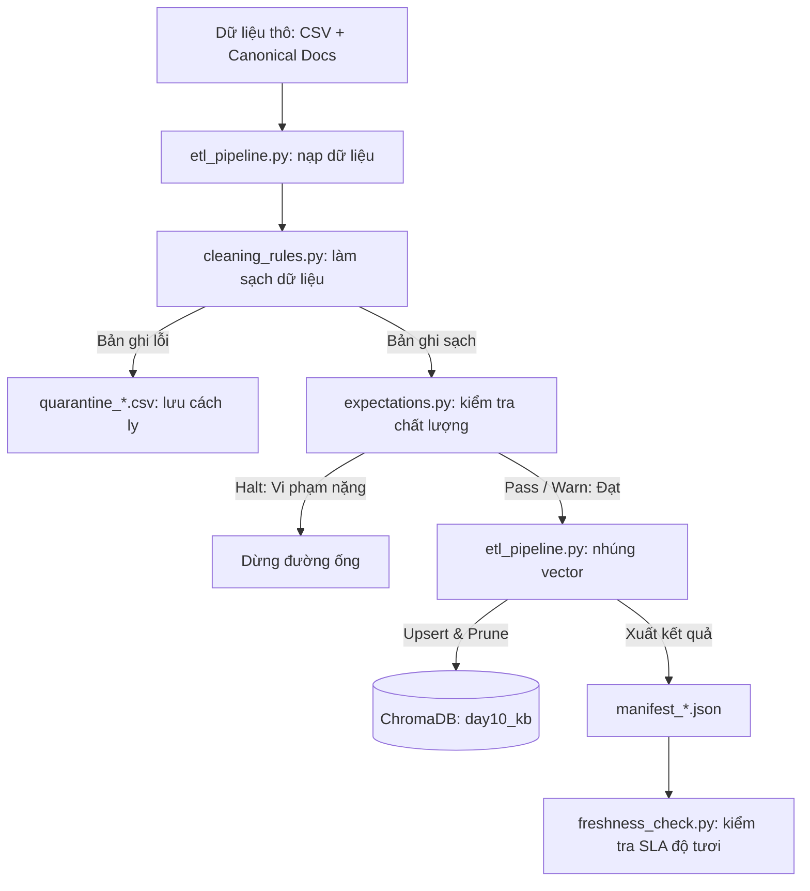

# Hướng Dẫn Kỹ Thuật (Technical Document) — Day 10 Lab

Tài liệu này trình bày chi tiết về logic, luồng xử lý dữ liệu (data flow), cách thức vận hành và hướng dẫn chạy kiểm thử cho từng tệp mã nguồn trong dự án **Day 10: Data Pipeline & Data Observability**.

---

## 1. Luồng xử lý tổng quan (Data Flow)



---

## 2. Giải thích chi tiết theo từng File

### 2.1. Tệp điều phối chính: [etl_pipeline.py](Lecture-Day-08-09-10/day10/lab/etl_pipeline.py)
*   **Chức năng:** Điểm chạy chính (entrypoint) điều phối toàn bộ đường ống dẫn dữ liệu.
*   **Logic xử lý:**
    1.  Nạp dữ liệu thô từ file CSV [policy_export_dirty.csv](Lecture-Day-08-09-10/day10/lab/data/raw/policy_export_dirty.csv).
    2.  Gọi hàm `load_canonical_docs` để tự động đọc, phân tách các tài liệu văn bản gốc trong thư mục `data/docs/` thành các chunk nhằm gia tăng độ phủ tri thức đạt 100%.
    3.  Đưa toàn bộ dữ liệu qua bộ lọc của `cleaning_rules.py` để lấy ra danh sách sạch (`cleaned`) và danh sách lỗi (`quarantine`).
    4.  Đưa danh sách sạch qua kiểm định của `expectations.py`. Nếu phát hiện lỗi nghiêm trọng (mức `halt`), dừng chương trình với mã thoát là `2` (trừ khi có cờ bỏ qua `--skip-validate`).
    5.  Thực hiện nhúng vector vào ChromaDB thông qua hàm `cmd_embed_internal` (sử dụng model offline `all-MiniLM-L6-v2`).
    6.  Sinh file manifest chứa thông tin chi tiết của phiên chạy (`run_id`, số lượng dòng, đường dẫn file) để phục vụ Data Observability.
    7.  Chạy giám sát Freshness SLA dựa trên mốc thời gian xuất bản dữ liệu.

---

### 2.2. Tệp quy tắc làm sạch: [cleaning_rules.py](Lecture-Day-08-09-10/day10/lab/transform/cleaning_rules.py)
*   **Chức năng:** Làm sạch, chuẩn hóa và phân loại dữ liệu lỗi vào quarantine.
*   **Các quy tắc làm sạch triển khai:**
    *   *Rule 1-6 (Baseline):* Kiểm tra doc_id hợp lệ (allowlist), chuẩn hóa định dạng ngày tháng sang ISO (`YYYY-MM-DD`), loại bỏ chính sách HR cũ (trước 2026), loại bỏ trùng lặp nội dung, tự động chuyển đổi cửa sổ hoàn trả từ 14 ngày (bản stale v3) về 7 ngày (bản chuẩn v4).
    *   *Rule 7 (New - Chuẩn hóa khoảng trắng):* Loại bỏ các ký tự xuống dòng và khoảng trắng dư thừa trong văn bản.
    *   *Rule 8 (New - Cách ly tài liệu nháp):* Quét tìm và cách ly các bản ghi chứa placeholder nháp như `[TODO]`, `[draft]`, `<placeholder>`, tránh đưa thông tin chưa hoàn thiện vào cơ sở tri thức.
    *   *Rule 9 (New - Cách ly ngày tương lai):* Phát hiện và cách ly các tài liệu nhập sai năm hiệu lực (ngày hiệu lực sau `2028-12-31`).

---

### 2.3. Tệp kiểm định chất lượng: [expectations.py](Lecture-Day-08-09-10/day10/lab/quality/expectations.py)
*   **Chức năng:** Đóng vai trò là Cổng Chất Lượng (Quality Gate) trước khi dữ liệu được nạp vào Vector DB.
*   **Các quy tắc kiểm định (Expectations):**
    *   *E1 - E6:* Đảm bảo có ít nhất 1 dòng dữ liệu sạch; không có doc_id rỗng; chính sách hoàn tiền sau làm sạch không còn chứa "14 ngày"; độ dài tối thiểu của chunk >= 8; ngày hiệu lực đúng định dạng ISO; chính sách nghỉ phép không chứa "10 ngày phép".
    *   *E7 (New - Max Quarantine Ratio - Halt):* Kiểm tra tỷ lệ lỗi. Nếu lượng dữ liệu bị cách ly vượt quá 60% tổng lượng đầu vào thô, đường ống sẽ tự động chặn (halt) để chống lỗi hỏng cấu trúc hàng loạt từ hệ nguồn.
    *   *E8 (New - Doc Distribution - Warn):* Đưa ra cảnh báo nếu phát hiện thiếu hụt bất kỳ danh mục tài liệu bắt buộc nào trong hợp đồng dữ liệu.

---

### 2.4. Tệp đánh giá tìm kiếm: [eval_retrieval.py](Lecture-Day-08-09-10/day10/lab/eval_retrieval.py)
*   **Chức năng:** Chạy đánh giá chất lượng truy xuất (RAG retrieval quality).
*   **Logic xử lý:**
    *   Đọc bộ câu hỏi kiểm thử từ file `data/test_questions.json`.
    *   Truy vấn trực tiếp ChromaDB để lấy ra Top-K kết quả.
    *   Kiểm định xem kết quả trả về có chứa từ khóa mong đợi (`contains_expected`) hoặc chứa từ khóa bị cấm (`hits_forbidden`) hay không. Xuất báo cáo dạng CSV để làm bằng chứng (evidence).

---

### 2.5. Tệp chấm điểm tự động: [grading_run.py](Lecture-Day-08-09-10/day10/lab/grading_run.py)
*   **Chức năng:** Tạo báo cáo kết quả chấm điểm định dạng JSONL gửi cho giảng viên.
*   **Logic:** Chạy truy vấn 3 câu hỏi bắt buộc (`gq_d10_01` đến `gq_d10_03`) để xác thực tính đúng đắn của chính sách hoàn tiền 7 ngày và chính sách nghỉ phép 12 ngày hiện hành.

---

### 2.6. Tệp truy vấn tương tác: [query_kb.py](Lecture-Day-08-09-10/day10/lab/query_kb.py)
*   **Chức năng:** Cung cấp giao diện tương tác dòng lệnh (CLI) giúp người dùng nhập câu hỏi trực tiếp để kiểm thử live khả năng tìm kiếm của ChromaDB.
*   **Đặc điểm:** Tự động phân giải đường dẫn database tuyệt đối từ thư mục script, giúp chạy ổn định từ bất kỳ thư mục làm việc nào.

---

## 3. Cách chạy đường ống dữ liệu (E2E Run)

Thực hiện các lệnh sau tại thư mục `day10/lab`:

```bash
# 1. Chạy đường ống làm sạch, kiểm định chất lượng và nhúng vector tri thức
python etl_pipeline.py run

# 2. Kiểm tra giám sát Freshness SLA (thay run-id bằng thời gian thực tế chạy của bạn)
python etl_pipeline.py freshness --manifest artifacts/manifests/manifest_<run-id>.json

# 3. Chạy đánh giá chất lượng tìm kiếm (sinh file báo cáo before/after)
python eval_retrieval.py

# 4. Chạy tạo file chấm điểm gửi giảng viên
python grading_run.py

# 5. Khởi động terminal tương tác để hỏi đáp trực tiếp
python query_kb.py
```
